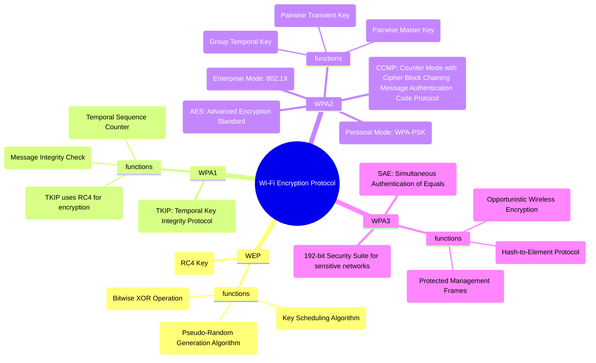

# Cryptographic Algorithm



## XOR cipher

### Code

```
def xor_encrypt_decrypt(text, key):
    encrypted_text = ""
    for i in range(len(text)):
        encrypted_text += chr(ord(text[i]) ^ ord(key[i % len(key)]))
    return encrypted_text
```

- takes `text` as string and `key` as string, as parameters.
- `ord(char)` finds unicode position for given character.
- `ord(text[i]) ^ ord(key[i % len(key)]` does a bitwise XOR operation between the Unicode value of the current character in the text and the corresponding character in the key.
- `chr(number)` finds the character for a given position.
- returns `encrypted_text`
