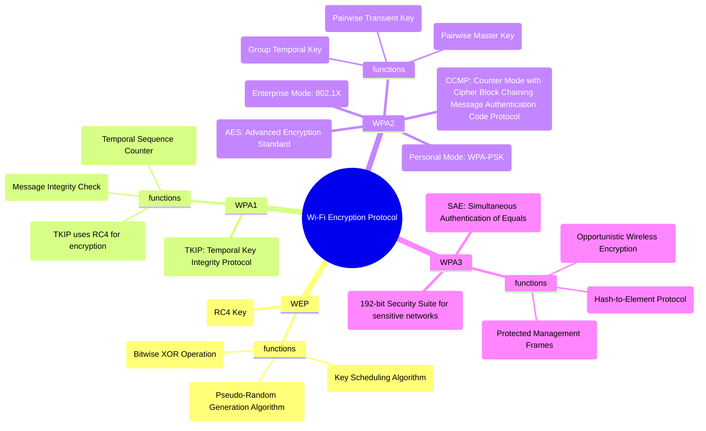

### Cryptography

This folder contains information about the encryption methods used in the WiFi Connection Simulation. Cryptography plays a crucial role in securing the connection between the client and the server by encrypting authentication challenges and transmitted data.

## Table of Contents

1. [Introduction](#introduction)
2. [Encryption in the Simulation](#encryption-in-the-simulation)
3. [Encryption Protocols](#encryption-protocols)

---

## Introduction

Cryptography ensures that communication between devices is private and secure. In real WiFi networks, encryption is used to:

- Authenticate devices trying to connect.
- Protect data from being intercepted or altered during transmission.

This folder focuses on the encryption techniques used in the simulation, explaining how cryptography works in networking.

## Encryption in the Simulation

The simulation demonstrates how encryption is used in two main steps:

1. **Authentication**:
    - The server sends a unique challenge to the client.
    - The client encrypts the challenge using the password and sends it back.
    - The server validates the response by encrypting the challenge itself and comparing results.

2. **Data Transmission**:
    - After authentication, data sent between the client and server is encrypted using the RC4 stream cipher.

These steps replicate how older encryption protocols like WEP worked. However, WEP is outdated and vulnerable in real-world applications, so newer protocols like WPA (Wi-Fi Protected Access) have replaced it.

---

## Encryption Protocols

### **[WEP (Wired Equivalent Privacy)](WEP/README.md)**

- **WEP** was the first widely used Wi-Fi encryption protocol.
- It uses the **RC4 stream cipher** to encrypt data.
- WEP has several vulnerabilities, including weak key management and flaws in its encryption algorithm, which make it insecure for modern use.
- In this simulation, WEP is used for educational purposes, but it is no longer recommended for real-world applications.

### **[WPA (Wi-Fi Protected Access)](WPA/README.md)**

- **WPA** is a stronger encryption protocol than WEP, introduced to fix its security flaws.
- It uses **TKIP (Temporal Key Integrity Protocol)** for encryption, which dynamically changes the encryption key during communication.
- While WPA offers better security than WEP, it is still vulnerable compared to WPA2 and WPA3.

### **WPA2 (Wi-Fi Protected Access 2)**

- **WPA2** uses **AES (Advanced Encryption Standard)**, a much stronger encryption method than RC4.
- It supports two modes:
    - **Enterprise Mode (802.1X)**: Requires additional authentication for business environments.
    - **Personal Mode (WPA-PSK)**: Uses a pre-shared key for home networks.
- WPA2 is the most widely used security protocol for Wi-Fi networks.

### **WPA3 (Wi-Fi Protected Access 3)**

- **WPA3** is the latest Wi-Fi security standard, offering even stronger encryption and protection against common attacks.
- It uses a **192-bit security suite** for sensitive networks and includes **SAE (Simultaneous Authentication of Equals)** for more secure authentication.
- WPA3 also introduces features like **OWE (Opportunistic Wireless Encryption)** and **PMF (Protected Management Frames)** to further improve security.

