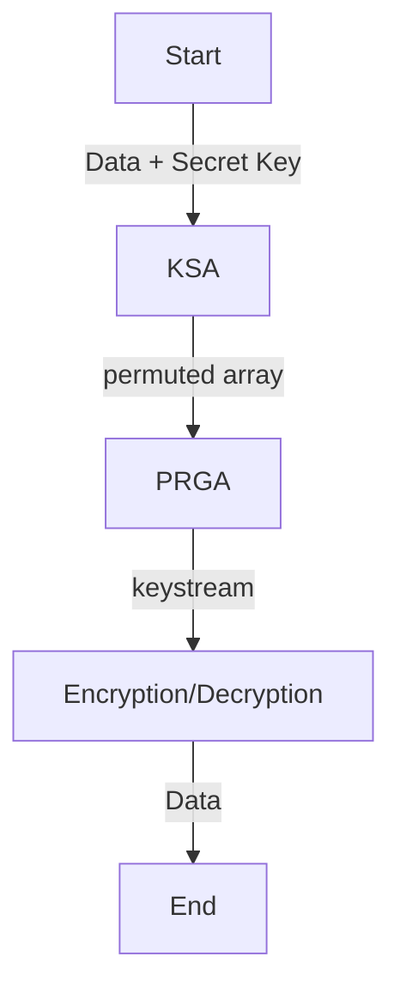

# RC4 stream cipher

RC4 is a stream cipher that generates a pseudo-random key stream to encrypt or decrypt data.



## Code

```
def rc4(text, key):
    S = list(range(256))
    S = ksa(str(key),S)
    keystream = prga(S,len(text))
    encrypted = xor_encrypt_decrypt(text,keystream)

    return encrypted
```

Check out the [code](../../utils/rc4.py).

## How RC4 Algorithm Works

RC4 is a stream cipher that generates a pseudo-random key stream to encrypt or decrypt data.

### 1. **Key Scheduling Algorithm (KSA)**
- The algorithm initializes a permutation array `S` of size 256 (values 0 to 255).
- A secret key is used to shuffle this array. The shuffling ensures the key influences the final state of `S`.

#### Code

```
def ksa(key,S):
    key = [ord(char) for char in key] # string to byte
    j = 0
    for i in range(256):
        j = (j + S[i] + key[i % len(key)]) % 256 # Now, j relies on the key
        S[i], S[j] = S[j], S[i]  # Swap S[i] and S[j]
    return S
```

### 2. **Pseudo-Random Generation Algorithm (PRGA)**
- Once the `S` array is initialized, RC4 generates a key stream.

#### Code

```
def prga(S, length):
    i,j = 0,0
    key_stream = []

    for _ in range(length):
        i = (i + 1) % 256
        j = (j + S[i]) % 256
        S[i], S[j] = S[j], S[i]

        key_stream_byte = S[(S[i] + S[j]) % 256]
        key_stream.append(key_stream_byte)
