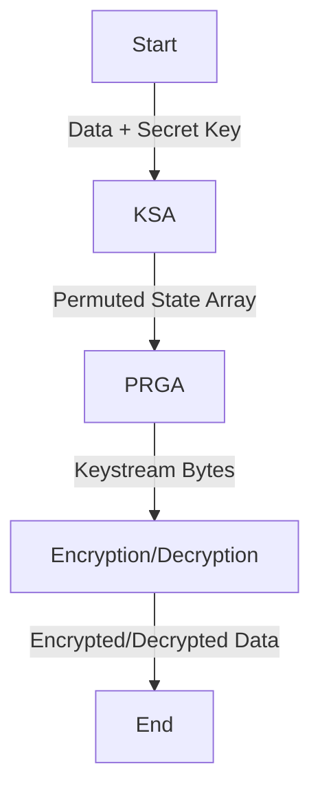

# RC4 Stream Cipher

RC4 is a stream cipher that generates a pseudo-random key stream to encrypt or decrypt data. It uses two main components:

1. **Key Scheduling Algorithm (KSA)**: Initializes and shuffles the state array based on the secret key.
2. **Pseudo-Random Generation Algorithm (PRGA)**: Produces a key stream for encryption and decryption.



---

## How RC4 Algorithm Works

### 1. **Key Scheduling Algorithm (KSA)**
The KSA initializes a permutation array `S` of size 256, which is shuffled based on the secret key. This ensures the key influences the final state of `S`.

#### Code
```python
def ksa(key, S):
    key = [ord(char) for char in key]  # Convert key to byte array
    j = 0
    for i in range(256):
        j = (j + S[i] + key[i % len(key)]) % 256  # Update j using the key
        S[i], S[j] = S[j], S[i]  # Swap elements in S
    return S
```

---

### 2. **Pseudo-Random Generation Algorithm (PRGA)**
The PRGA generates a pseudo-random key stream based on the shuffled `S` array.

#### Code
```python
def prga(S, length):
    i, j = 0, 0
    key_stream = []

    for _ in range(length):
        i = (i + 1) % 256
        j = (j + S[i]) % 256
        S[i], S[j] = S[j], S[i]  # Swap elements in S

        key_stream_byte = S[(S[i] + S[j]) % 256]
        key_stream.append(key_stream_byte)
    return key_stream
```

---

### 3. **XOR Cipher**
The XOR cipher combines the plaintext (or ciphertext) with the key stream to produce encrypted or decrypted output.

#### Code
```python
def xor_encrypt_decrypt(text, key):
    result = ""
    for i in range(len(text)):
        result += chr(ord(text[i]) ^ ord(key[i % len(key)]))
    return result
```

---

### Complete RC4 Implementation

```python
def rc4(text, key):
    S = list(range(256))  # Initialize state array
    S = ksa(key, S)  # Key Scheduling
    keystream = prga(S, len(text))  # Generate key stream
    encrypted = xor_encrypt_decrypt(text, keystream)  # XOR with key stream
    return encrypted
```

---

## Limitations of RC4

RC4 has several weaknesses that make it unsuitable for modern cryptographic applications:

1. **Key Stream Bias**: The initial bytes of the key stream are biased, allowing attackers to infer information about the key.
2. **Vulnerable to Replay Attacks**: Reusing the same key for different data can reveal plaintext patterns.
3. **Deprecated**: RC4 is no longer considered secure and has been replaced by more robust algorithms in modern systems.

---

For more details, check the [RC4 Code Implementation](../../utils/rc4.py).
