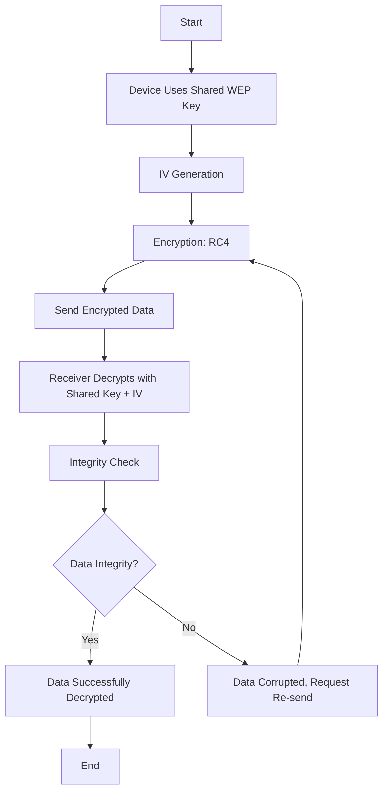

# WEP Protocol

## Device Authentication

1. A device tries to connect to a router.
2. The router sends a unique challenge (e.g., random data).
3. The device encrypts the challenge using the password (shared WEP key).
4. The encrypted challenge is sent back to the router.
5. The router encrypts the challenge on its side and compares the results.
6. If the encrypted values match, the device is authenticated and can connect.

---

## Encryption and Decryption Process

The WEP protocol secures communication using RC4 encryption and a 24-bit Initialization Vector (IV). The process is as follows:

---

### Steps:

1. **Device Uses Shared WEP Key**:  
   Both the device and the router have a pre-shared WEP key used for encryption and decryption.

2. **IV Generation (24 bits)**:  
   An Initialization Vector (IV) is generated to make each packet's encryption unique. WEP uses a 24-bit IV, which is combined with the shared key for encryption.

3. **Encryption: RC4**:  
   RC4, a stream cipher, encrypts the plaintext data using the WEP key and the IV. See [RC4 Documentation](rc4.md) for more details.

4. **Send Encrypted Data**:  
   The encrypted data (ciphertext) and the IV are sent over the network.

5. **Receiver Decrypts**:  
   The receiver (e.g., router or device) decrypts the ciphertext using the shared WEP key and the transmitted IV.

6. **Integrity Check (CRC-32)**:  
   A CRC-32 checksum is included in the encrypted packet. After decryption, the checksum ensures that the data hasn’t been tampered with.

7. **Data Integrity?**:
    - **If Verified**: The data is accepted and processed.
    - **If Corrupted**: The receiver requests a re-send of the corrupted packet.

---

## Limitations of WEP

WEP was one of the first WiFi encryption protocols, but it has significant vulnerabilities:

1. **Short IV (24 bits)**:  
   The small IV size means that the same IV can be reused, leading to predictable encryption patterns.

2. **Weak RC4 Key Scheduling**:  
   The way WEP combines the IV with the shared key is flawed, making it easier for attackers to crack the encryption.

3. **No Key Management**:  
   WEP does not have a secure way to distribute or change keys, leading to static keys being reused.

Because of these issues, WEP is no longer recommended for real-world networks and has been replaced by stronger protocols like WPA2 and WPA3.

