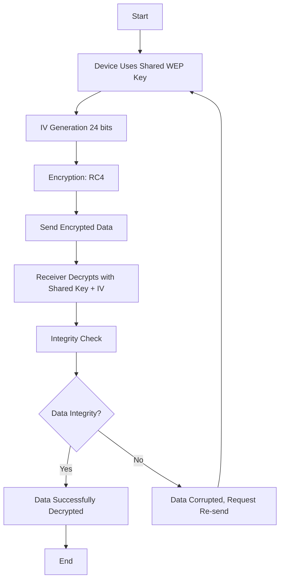

# WEP protocol

## Device authentification 

1. A device tries to connect to a router.
2. The router sends the device a challenge.
3. The device encrypts the challenge with password input by the user.
4. The device sends the result to the router.
5. The router encrypts the challenge and compares.
6. If the results is the same, the device is now connected.

## How does it work ? 

### Steps :
1. **Device Uses Shared WEP Key**: The device and router have a pre-shared WEP key for encryption.
2. **IV Generation (24 bits)**: A 24-bit initialization vector (IV) is generated to ensure encryption is unique for each packet.
3. **Encryption: RC4**: RC4 encryption is applied using the WEP key and the IV. See [documentation](rc4.md).
4. **Send Encrypted Data**: The encrypted data (ciphertext) and IV are sent over the network.
5. **Receiver Decrypts**: The receiving device uses the shared WEP key and the IV to decrypt the data.
6. **Integrity Check (CRC-32)**: A CRC-32 checksum is used to verify the integrity of the decrypted data.
7. **Data Integrity?**: If the data is verified correctly, it is accepted; otherwise, a re-send is requested.
