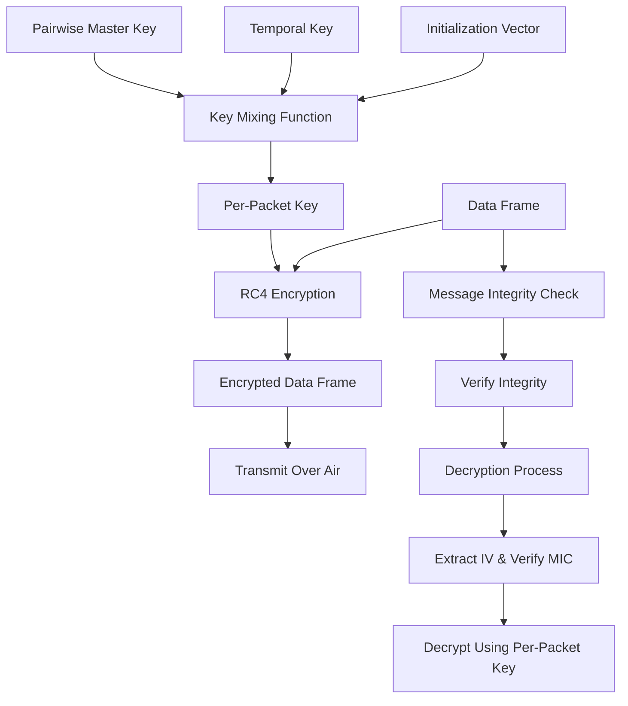

### TKIP (Temporal Key Integrity Protocol)

**TKIP** is a security protocol used in the **WPA (Wi-Fi Protected Access)** standard to provide enhanced security for wireless networks. It was designed as a replacement for **WEP** (Wired Equivalent Privacy) to address vulnerabilities in WEP.

### Key Features of TKIP:

1. **Temporal Key Integrity**: TKIP uses a dynamic per-packet keying mechanism to generate unique encryption keys for each packet sent over the wireless network, ensuring that the same key is never used twice.

2. **RC4 Encryption**: TKIP uses the RC4 stream cipher, the same cipher as WEP, but applies several enhancements to make it more secure. These enhancements include the use of a unique initialization vector (IV) for each packet, which mitigates some of the security flaws in WEP.

3. **MIC (Message Integrity Check)**: TKIP includes a message integrity check (MIC), also called Michael, which helps prevent tampering with the data by detecting and discarding any modified packets.

4. **TSC (Temporal Sequence Counter)**: The TSC is used to track the number of packets sent over the network, ensuring that no packets are replayed or processed out of order.

5. **Backward Compatibility**: TKIP is designed to be backward compatible with legacy hardware that supports WEP, meaning that it can be deployed on existing devices without requiring hardware upgrades.

### Limitations of TKIP:
- **Outdated**: TKIP is no longer considered secure enough for modern networks. It has been replaced by the more secure **AES (Advanced Encryption Standard)** in **WPA2**.
- **Slow Performance**: Because TKIP adds extra layers of encryption and integrity checks, it can result in slower network performance compared to more modern protocols.

### Conclusion:
While **TKIP** was a significant improvement over **WEP**, it is now considered outdated and insecure. Modern wireless networks use **WPA2** or **WPA3** with **AES** for stronger security. However, understanding TKIP remains useful, especially for legacy systems still using WPA.