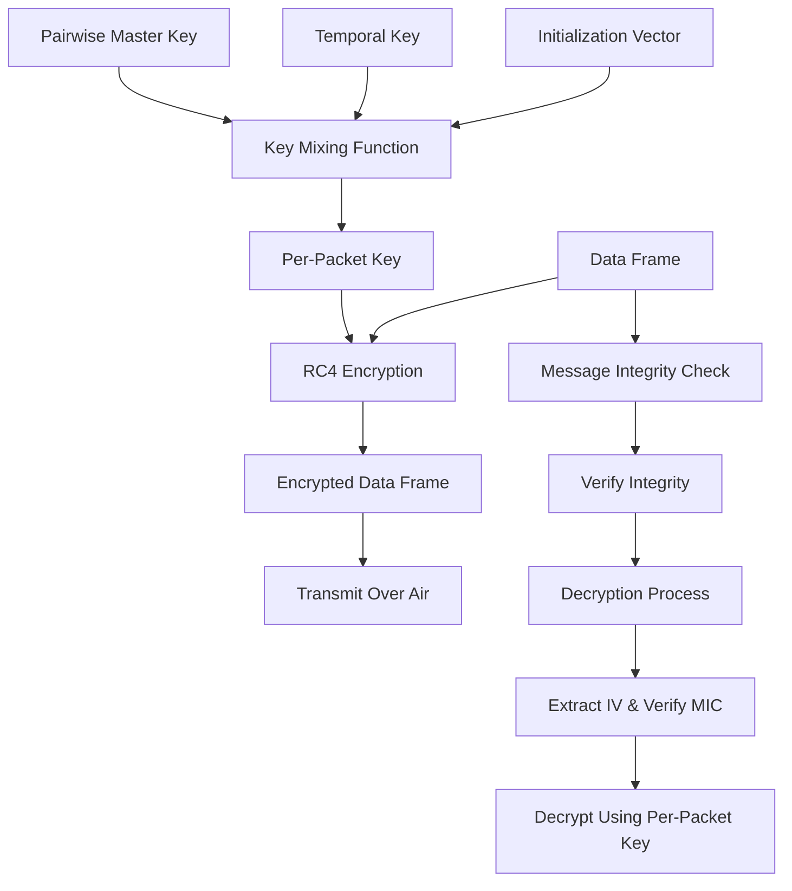

# TKIP

TKIP (Temporal Key Integrity Protocol) is a key management and encryption protocol used in Wi-Fi networks as part of WPA (Wi-Fi Protected Access).

```mermaid
graph TD
    A[Pairwise Master Key ] --> B[Key Mixing Function]
    C[Temporal Key] --> B
    D[Initialization Vector ] --> B
    B --> E[Per-Packet Key]
    E --> F[RC4 Encryption]
    G[Data Frame] --> F
    F --> H[Encrypted Data Frame]
    G --> I[Message Integrity Check ]
    I --> J[Verify Integrity]
    H --> K[Transmit Over Air]
    J --> L[Decryption Process]
    L --> M[Extract IV & Verify MIC]
    M --> N[Decrypt Using Per-Packet Key]

```