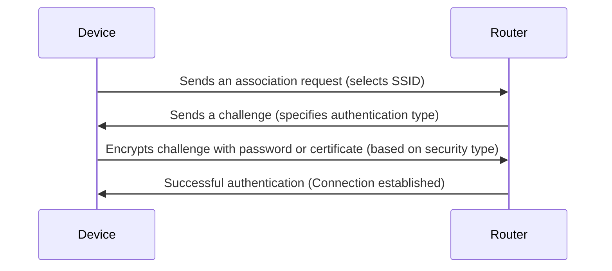
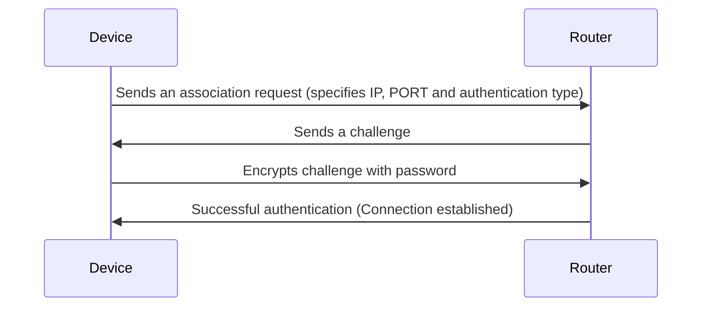

# Authentification

## Device authentification

1. A device tries to connect to a router.
2. The router sends the device a challenge.
3. The device encrypts the challenge with password input by the user.
4. The device sends the result to the router.
5. The router encrypts the challenge and compares.
6. If the results is the same, the device is now connected.

## Security
- Open Network: No password is required; you connect immediately.
- Secured Network: You need to enter a password or use other authentication methods such as:
  - WEP: Now considered as vulnerable. See [documentation](../Cryptography/WEP/README.md).
  - WPA/WPA2 Password: Common in most home and office networks. See [documentation](../Cryptography/WPA/README.md).
  - WPA3: More secure modern standard.
  - Enterprise Authentication: Requires credentials like a username and password or a certificate.

## Simulation

