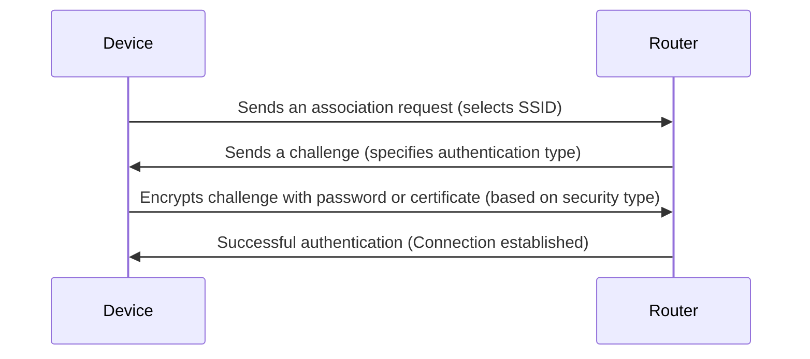
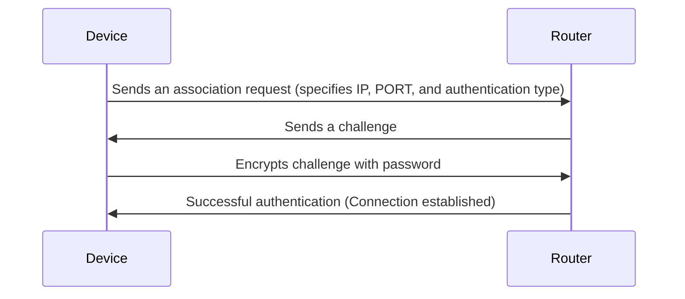

# Authentication

## **Device Authentication**

1. A device attempts to connect to a router.
2. The router sends the device a challenge (e.g., a random string or timestamp).
3. The device encrypts the challenge using the password provided by the user.
4. The device sends the encrypted result to the router.
5. The router encrypts the challenge using its stored password and compares the result with the device’s response.
6. If the results match, the device is authenticated and connected to the network.

### **Security Types**

- **Open Network**: No authentication required; devices connect immediately.
- **Secured Network**: Authentication is required using one of the following methods:
  - **WEP**: An outdated protocol with known vulnerabilities. See [WEP Documentation](../Cryptography/WEP/README.md).
  - **WPA/WPA2 Password**: Commonly used in home and office networks. These protocols offer stronger security compared to WEP. See [WPA Documentation](../Cryptography/WPA/README.md).
  - **WPA3**: The latest and most secure standard, featuring better encryption and resistance to brute-force attacks.
  - **Enterprise Authentication**: Requires credentials (username/password) or certificates, typically used in corporate environments.

---

---

## **Simulation**

This simulation models the basic steps of WiFi authentication with the following differences:
- Focuses on WEP encryption for simplicity, with plans to expand to WPA2/WPA3 in the future.
- Requires manual configuration of IP and PORT settings by the user.
- Eliminates DHCP, simplifying IP assignment.

---

---

### **Future Enhancements**

- Support for WPA2/WPA3 authentication.
- Implementation of dynamic key generation.
- Addition of a handshake protocol for key exchange.
- Simulation of more advanced enterprise authentication methods.
