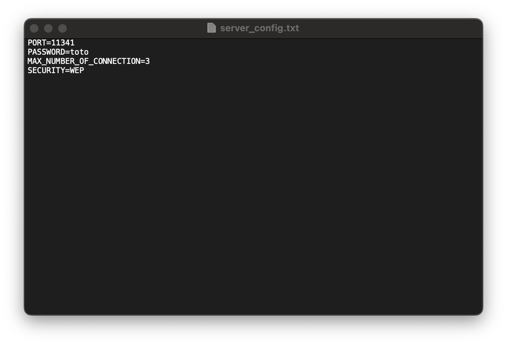
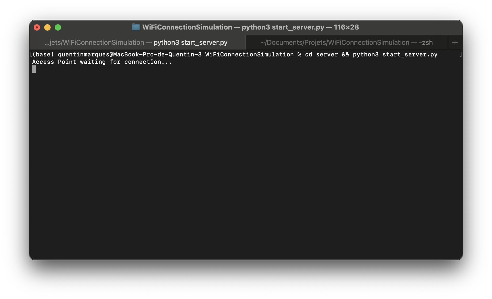
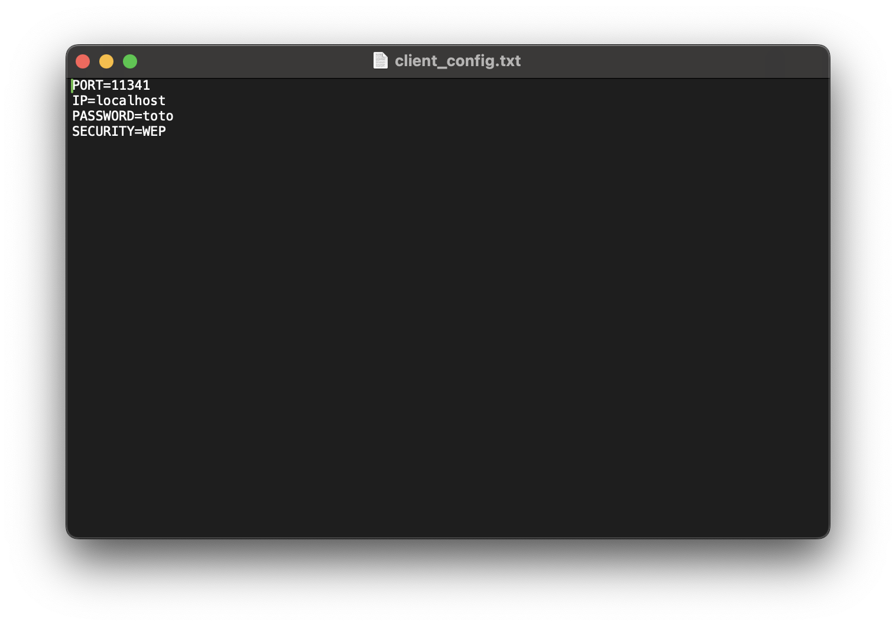
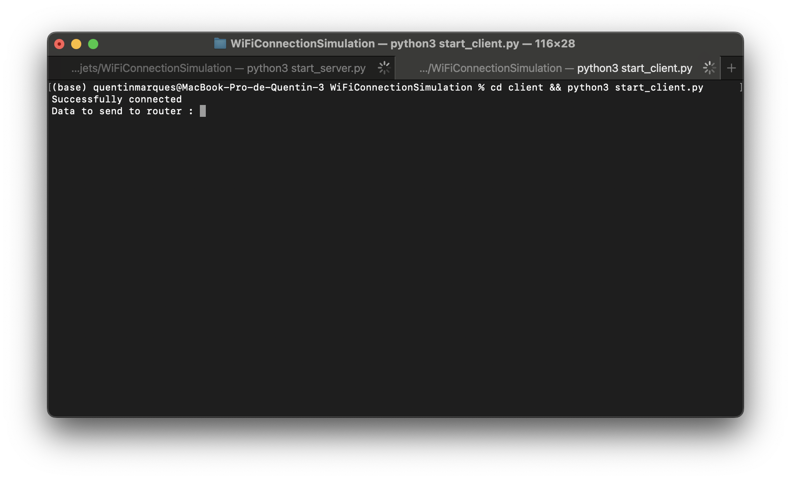
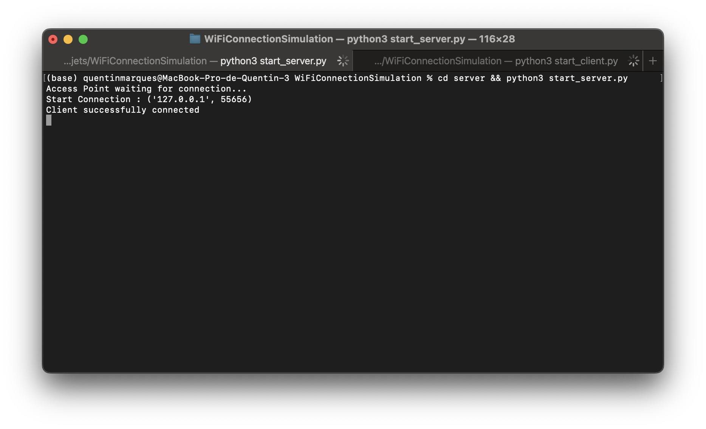
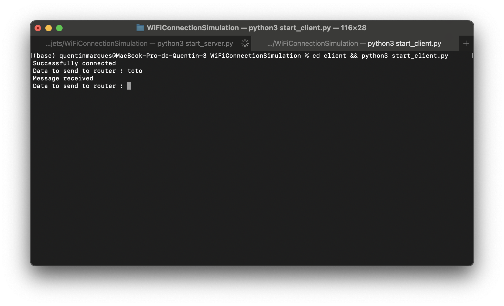
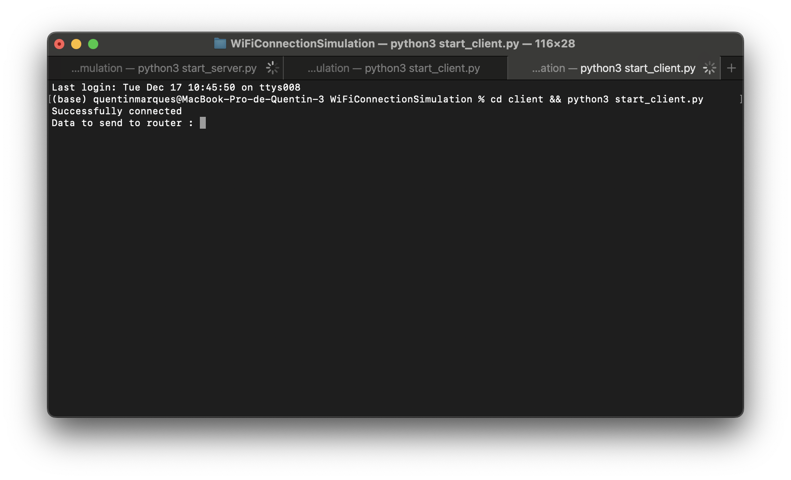
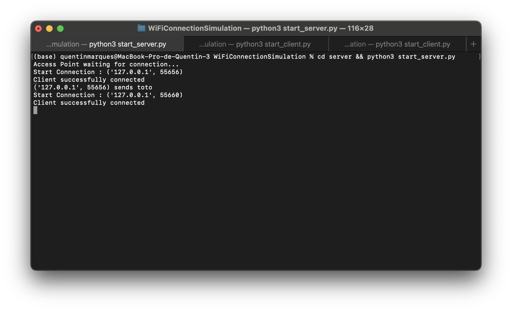
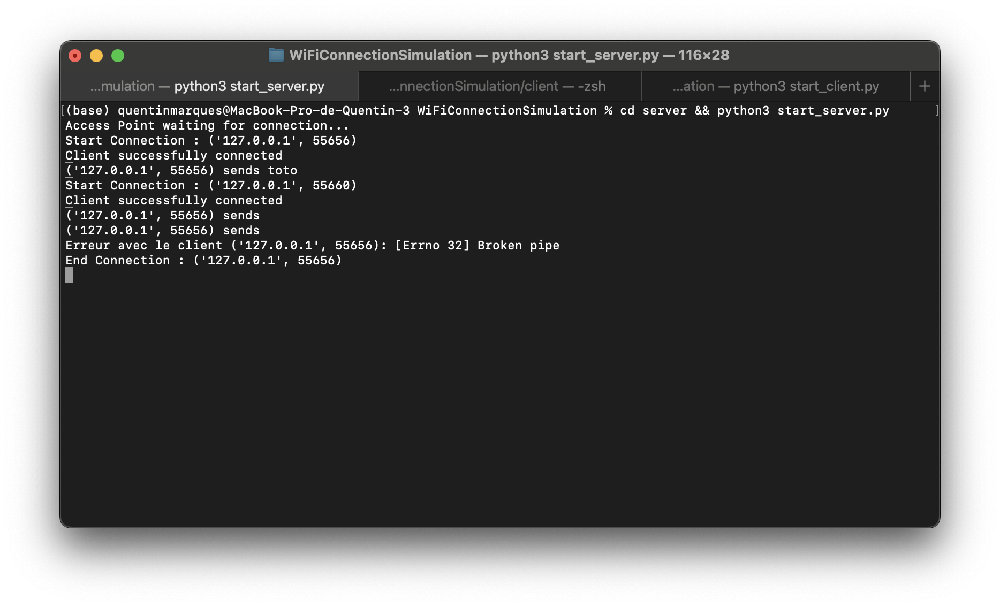

# WiFi Encryption Simulation

Full project on https://github.com/Kent1mrqs/WiFiEncryptionSimulation.

## Overview
This project was developed for an RTU Cryptography class, I chose WiFi Encryption Simulation to explore the practical application of cryptographic algorithms in network security.
This project simulates the process of connecting a device to a WiFi network, including server authentication, encryption, and data transfer. The simulation demonstrates the steps involved in establishing a secure connection between a client and a server, with encryption protocols playing a central role in securing communication.

## Table of Contents
1. [Introduction to WiFi Connections](#introduction-to-wifi-connections)
2. [Simulation Overview](#simulation-overview)
3. [Connection Process](#connection-process)
   - [Client Authentication](#client-authentication)
   - [Data Transfer](#data-transfer)
3. [Getting Started](#getting-started)
   - [1. Configure the Server](#1-configure-the-server)
   - [2. Start the Server](#2-start-the-server)
   - [3. Configure the Client](#3-configure-the-client)
   - [4. Start the Client](#4-start-the-client)
5. [Documentation](#documentation)
6. [Screenshots](#screenshots)


## Introduction to WiFi Connections
In a real WiFi connection, the following steps occur:

1. **Discover Available Networks:**
   The WiFi device scans for nearby networks and displays the available SSIDs (Service Set Identifiers) for the user to choose from.

2. **Authentication:**
   The device attempts to connect to the selected WiFi network by providing a password or credentials. The router verifies these credentials.

3. **IP Address Assignment:**
   Once authenticated, the router assigns an IP address to the device using DHCP (Dynamic Host Configuration Protocol).

4. **Establish a Connection:**
   The device establishes a connection to the network, enabling communication with other devices and the internet.

5. **Security Handshake:**
   During the connection process, a handshake protocol is executed to exchange encryption keys securely and set up an encrypted communication channel.

6. **Information Communication:**
   Data is transmitted between the device and the router, encrypted to ensure confidentiality and integrity.

For detailed information, refer to the [WiFi documentation](Network/WiFi.md).

## Simulation Overview

The simulation involves two main components:

### 1. Server:
- Handles client connections.
- Issues authentication challenges.
- Validates clients and manages encrypted communication.

### 2. Client:
- Connects to the server using its configuration.
- Responds to authentication challenges.
- Sends encrypted data to the server after authentication.

## Connection Process
### Client Authentication
1. **Initiating Connection**:
   - The client sends a connection request to the server.
2. **Challenge-Response Mechanism**:
   - The server generates a unique challenge (current time in nanoseconds).
   - The client encrypts the challenge using the encryption protocol and the configured password.
   - The server validates the encrypted response by comparing it to its own encrypted challenge.
3. **Authentication Outcome**:
   - If the response is valid, the client is authenticated and can connect.

Refer to [Network/Authentication.md](Network/Authentification.md) for detailed authentication steps.

---

### Data Transfer
1. **Sending Data**:
   - The client sends encrypted data to the server using encryption.
2. **Receiving Data**:
   - The server decrypts the data and logs the received content.

Refer to [Cryptography/WEP/RC4.md](Cryptography/WEP/RC4.md) for encryption details.

## Getting Started
Follow these steps to set up and run the simulation:

### 1. Configure the Server
Open `server/server_config.txt` and configure the following parameters:
- **PORT:** The port number the server will use.
- **PASSWORD:** The password clients must use to connect.
- **MAX_NUMBER_OF_CONNECTION:** The maximum number of simultaneous client connections allowed.
- **SECURITY:** The encryption protocol to use.

### 2. Start the Server
Run the following command to start the server:
```bash
cd server && python3 start_server.py
```

### 3. Configure the Client
Open `client/client_config.txt` and configure the following parameters:
- **PORT:** The server’s port number.
- **IP:** The server’s IP address (use `localhost` if running on the same device).
- **PASSWORD:** The server’s password.
- **SECURITY:** The server’s encryption protocol (currently, only `WEP` is supported).

### 4. Start the Client
Run the following command to start the client:
```bash
cd client && python3 start_client.py
```

### 5. Client Connection
- The client initiates a connection to the server.
- The server issues a challenge to authenticate the client.
- Upon successful authentication, the server confirms the connection.

### 6. Data Transmission
- The client sends encrypted data to the server.
- The server decrypts and displays the data.

### 7. Additional Clients
The server supports multiple clients up to the configured limit. Each client follows the same connection and data transmission process.

### 8. End Connection
Connections can be terminated, with the server displaying the disconnection details.

## Documentation
- [Network Authentication](Network/Authentification.md): Detailed information on the authentication process.
- [Cryptography and WEP](Cryptography/README.md): Insights into the cryptographic protocols used, including RC4 and TKIP encryption.

## Screenshots

1. Configuring the Server
   

2. Starting the Server
   

3. Configuring the Client
   

4. Starting the Client
   

5. Client Connected to Server
   

6. Data Transmission
   

7. Adding a New Client
   
   

8. Ending the Connection
   


