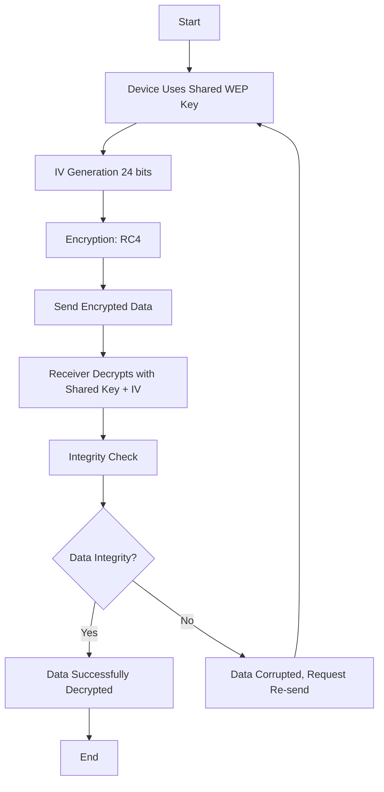

# WEP protocol

### Steps Covered:
1. **Device Uses Shared WEP Key**: The device and router have a pre-shared WEP key for encryption.
2. **IV Generation (24 bits)**: A 24-bit initialization vector (IV) is generated to ensure encryption is unique for each packet.
3. **Encryption: RC4**: RC4 encryption is applied using the WEP key and the IV. See [documentation](rc4.md).
4. **Send Encrypted Data**: The encrypted data (ciphertext) and IV are sent over the network.
5. **Receiver Decrypts**: The receiving device uses the shared WEP key and the IV to decrypt the data.
6. **Integrity Check (CRC-32)**: A CRC-32 checksum is used to verify the integrity of the decrypted data.
7. **Data Integrity?**: If the data is verified correctly, it is accepted; otherwise, a re-send is requested.
