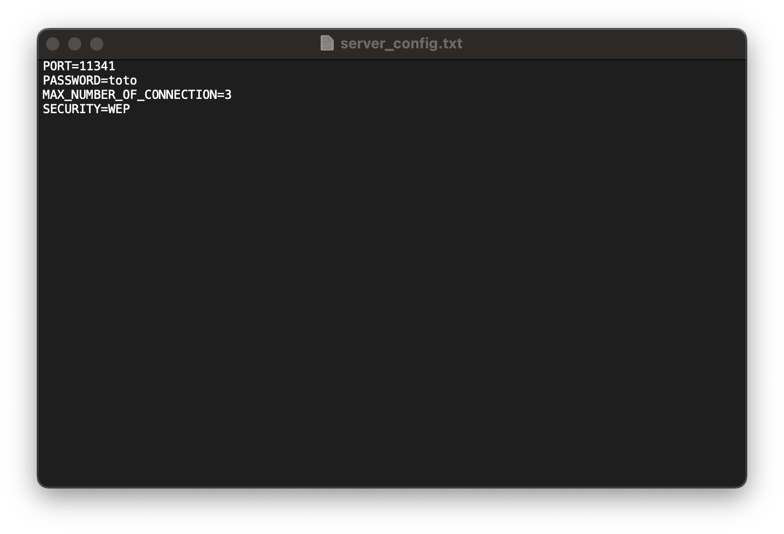
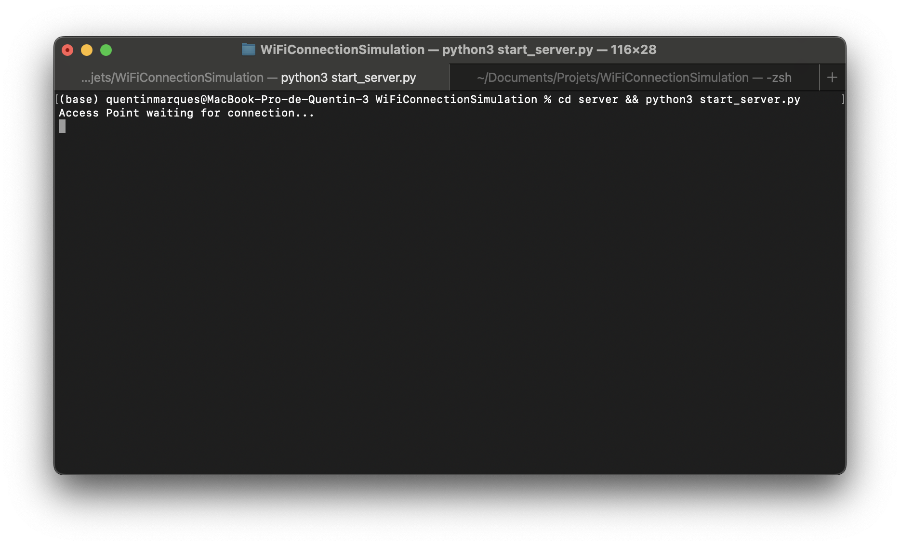
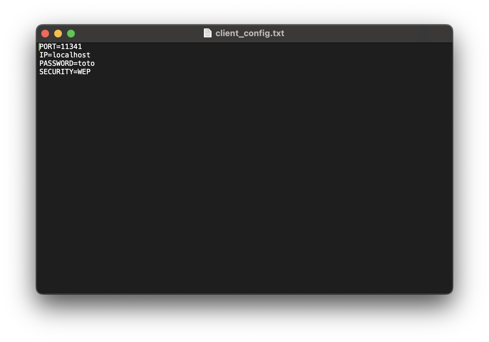
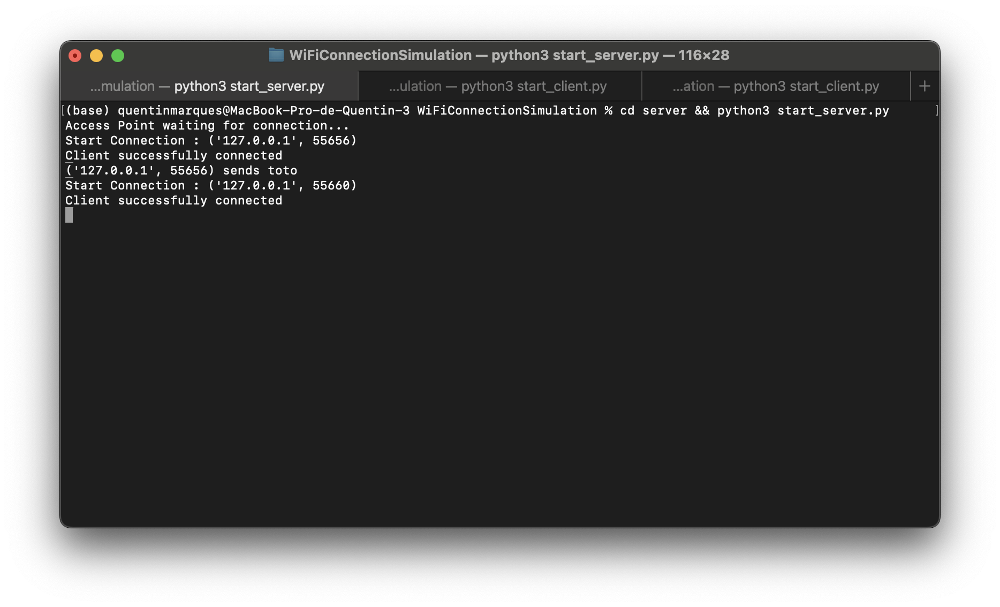

# Test
See on [github](https://github.com/Kent1mrqs/WiFiConnectionSimulation/tree/main/test).
# 1. Configure the server

Open [`server/server_config.txt`](server/server_config.txt) and complete it with wanted parameters.

- `PORT` : Port number you want to choose to start the server on.
- `PASSWORD` : Password you want to use for client to connect with.
- `MAX_NUMBER_OF_CONNECTION` : The number of client you allow to connect on the server.
- `SECURITY` : Suppose to choose encryption protocol between `WEP`, `WAP1`, `WAP2` and `WAP3`. Only `WEP` available for the moment.

# 2. Start the server
Then start the server with `cd server && python3 start_server.py`.

# 3. Configure the client
Open [`client/client_config.txt`](server/client_config.txt) and complete it with wanted parameters.

- `PORT` : Port number of your server.
- `IP` : IP of your server. `localhost` if it is on the same device.
- `PASSWORD` : Password of your server.
- `SECURITY` : Encryption protocol of your server. Only `WEP` available for the moment.

# 4. Start the client
Then start the server with `cd client && python3 start_client.py`.

Here is where the magic begins.
1. Client will begin a connection with server.
2. Server will send a `challenge` to client. In my case, the `challenge` is the time in nanoseconds, so that each challenge is unique.
3. Client will now use the encryption method of the server and the password to encrypt the received challenge and send it back to server.
4. Server will receive the encrypted challenge of client and will encrypt itself the challenge. If the results are the same, Client has the good password, and it can connect to the server : `Successfully connected`

Refer to [Network/Authentication.md](../Network/Authentification.md) for detailed information on Authentication, and [Cryptography/WEP](../Cryptography/README.md) for details on Cryptography.

# 5. Client connected to server

Once a client is connected on the server, the connection address is displayed : (`127.0.0.1`,55656) in the case of this example. 

# 6. Client sends data to server

Now, to send data from client to server. The data is first encrypted with RC4, the encryption protocol used in WEP.

See [Cryptography/WEP/RC4.md](../Cryptography/WEP/RC4.md).

# 7. Server receives data

Client (`127.0.0.1`,55656) sends `toto`.

# 8. New Client

# 8. End connection

